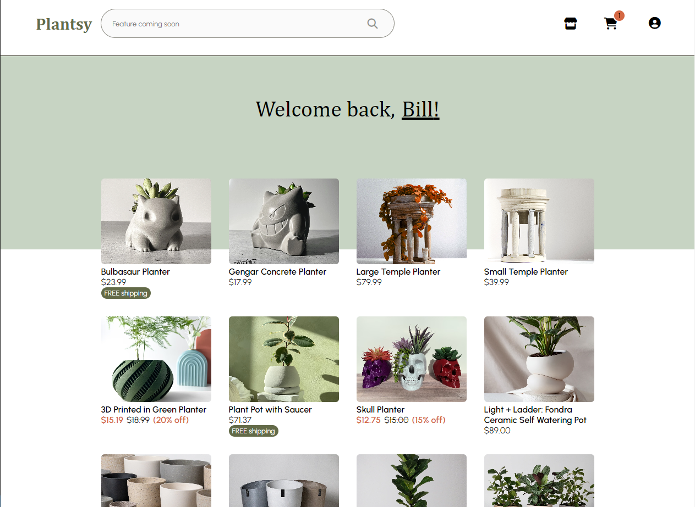
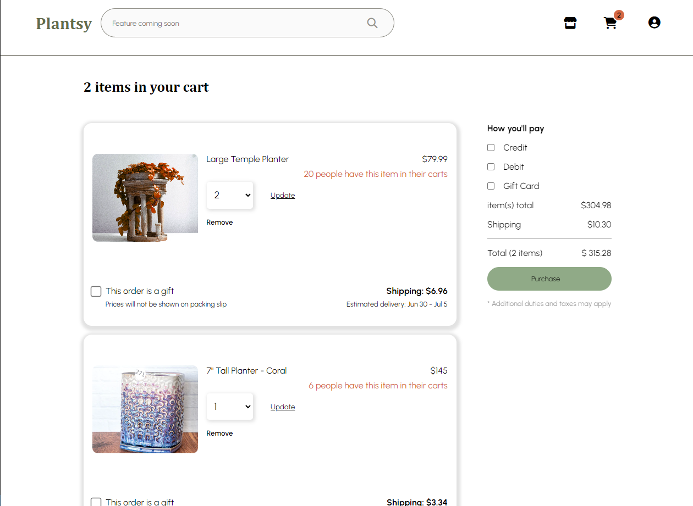
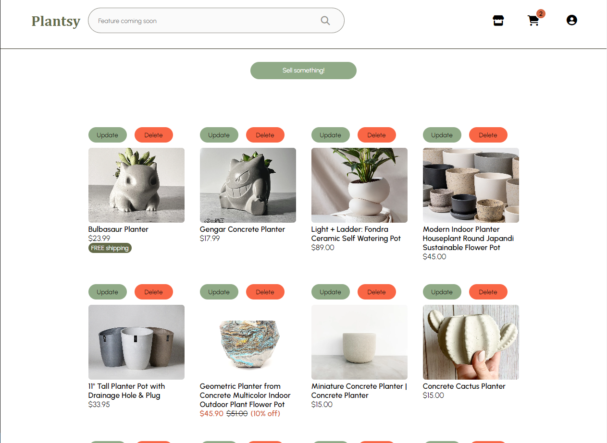
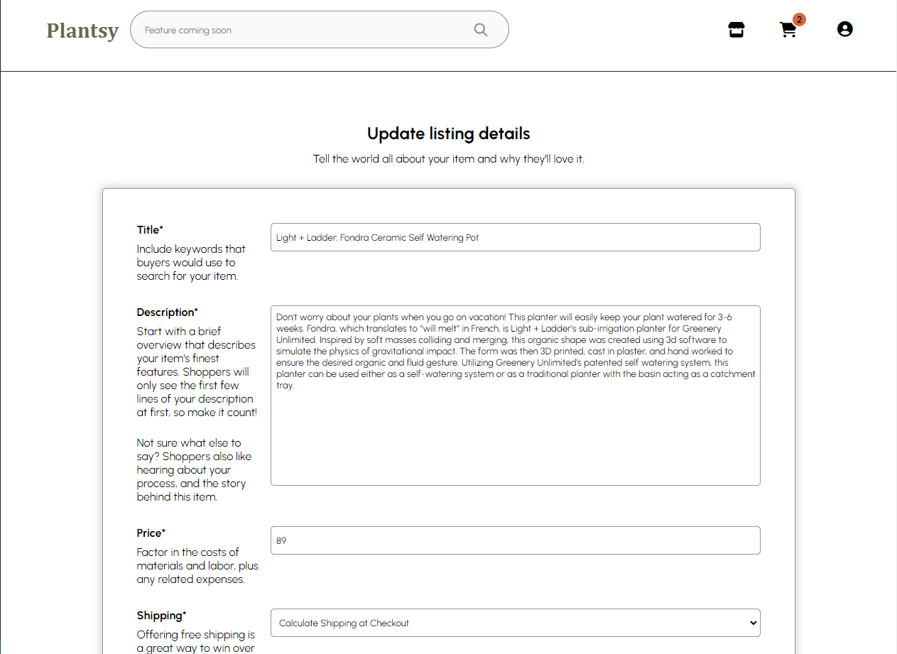
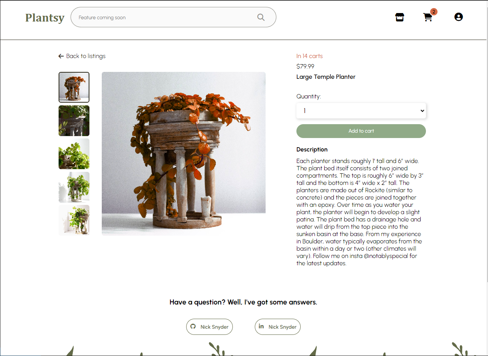

# PLANTSY (Capstone Project)

## About

Hi, thanks for checking out my project! This is my third fullstack web application created as an App Academy student. The app is a clone of Etsy with a plant themed spin and uses Python, Flask and SQLAlchemy for the backend structure. The front end was created using JavaScript, React, Redux and vanilla CSS to style the site.

Currently the app has functionality to authenticate users, view/create/delete/edit a listing and view/add/delete/delete all (purchase)/edit a shopping cart.

## Frontend screenshots
The home page displays all listings, this is viewable both when logged in or out.



The cart page shows all items in a users cart. Item quantity can be updated here and the total price will recalculate to reflect the changes. Items can also be removed from this page. The shipping cost, estimated delivery date and notification that the item is in other carts are all randomly generated to bring the site to life.



The shop page shows all of the logged in user's listings. Listings can be updated here or deleted.



Updating a listing will redirect the user to the listing form which is pre-populated with the listing's information.



The listing detail page shows all information about the selected listing. Clicking on the photo tiles will dynamically update the main image. The user can also add the item to their cart if they are logged in and not the owner. If a user is viewing a listing they own, the add button is replaced with an edit button to quickly edit a listing.



This site is currently live here: https://plantsy-lm98.onrender.com/. You can also clone the repo and run locally by following the instructions below.

## Getting started
1. Clone this repository (only this branch)

2. Install dependencies

      ```bash
      pipenv install -r requirements.txt
      ```

3. Create a **.env** file based on the example with proper settings for your
   development environment

4. Make sure the SQLite3 database connection URL is in the **.env** file

5. This starter organizes all tables inside the `flask_schema` schema, defined
   by the `SCHEMA` environment variable.  Replace the value for
   `SCHEMA` with a unique name, **making sure you use the snake_case
   convention**.

6. Get into your pipenv, migrate your database, seed your database, and run your Flask app

   ```bash
   pipenv shell
   ```

   ```bash
   flask db upgrade
   ```

   ```bash
   flask seed all
   ```

   ```bash
   flask run
   ```

7. To run the React App in development, checkout the [README](./react-app/README.md) inside the `react-app` directory.

8. Navigate to the react-app directory and install dependencies then start the app

   ```bash
   npm install
   ```

   ```bash
   npm start
   ```
